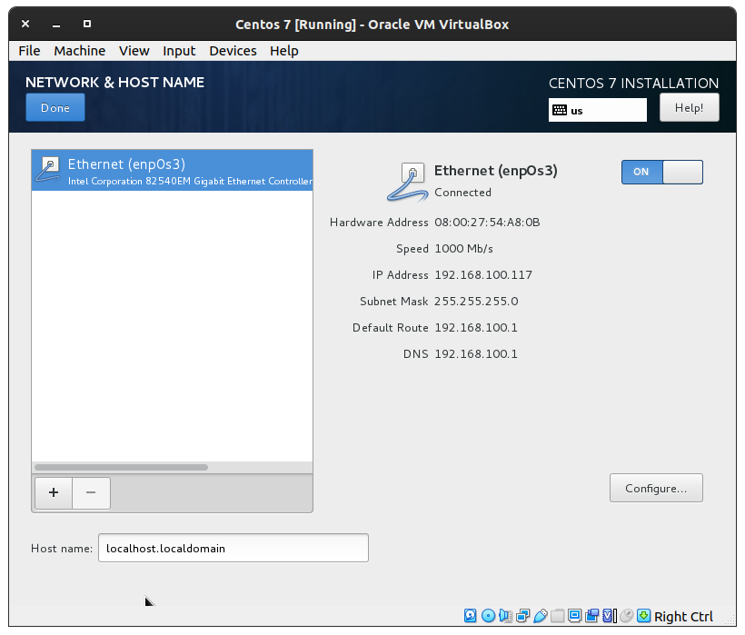

# Install CentOS 7 dan Set SSH

## Install CentOS 7
Pertama-tama mari kita buat sebuah virtual machine dengan spesifikasi berikut. Pastikan anda juga sudah mendownload ISO file dari CentOS-nya dan sudah anda pasang pada `Controller:IDE`. Setelah itu start virtual machine-nya.


Kemudian pilih bahasa yang akan digunakan.


Lalu pada menu **installation destination** mari kita disk yang kita gunakan. Disini saya memakai 20GB dan pilih opsi **i will configure partitionong**. Lalu klik `Done`.


Setelah itu kita set partisinya. Disini saya set dengan ukuran sebagai berikut:
 1. root folder: 15GB
 2. swap: 1GB
 3. home: 4GB


Lalu pada menu **network & hostname** aktifkan NIC.



Klik tombol **Begin installation**


Mari kita buat user baru dengan nama user01. Set juga password dari user dan pastikan centang **Make this user administrator**


Lalu set password untuk root. 


Tunggu proses instalasi selesai.


Setelah instalasi selesai kemudian klik tombol **Reboot**.


Kini kita bisa login menggunakan user yang sudah kita buat tadi, lalu kita ketikkan perinta `sudo su` untuk menjadi super user ataupun administrator.


Mari kita update terlebih dulu package pada centos kita menggunakan perintah `yum update`.


Setelah itu kita rubah hostname dari centos menjadi Myserver. dengan perintah `hostnamectl set-hostname new-hostname`.


Kita bisa cek menggunakan perintah `hostnamectl`. Disini kita telah berhasil mengubah hostname dari centos kita. 


lalu reboot centos dan kita telah mendapati centos kita dengan hostname barunya


## Set SSH
Ketikkan perintah `ssh-keygen` untuk mengenerate key pada komputer server kita. Lalu saat ditanya dimana kita akan menyimpan file key tekan enter saja untuk menyimpannya di lokasi default yakni di `/user/.ssh/id_rsa`. Lalu enter 2 kali untuk mengosongkan passphrase. Setelah itu kita akan mendapati 2 file yakni identification yaitu **id_rsa** dan public key yaitu **id_rsa.pub**.


Dalam melakukan generate key kita dapat memilih algoritma public key sebagai autentikasi kita. Ada beberapa algoritma tipe key yang dapat digunakan yaitu:
1. rsa - algoritma lama yang didasarkan pada kesulitan memfaktorkan bilangan besar.Semua klien SSH mendukung algoritme ini.Ukuran key yang digunakan biasanya 2048. 
2. dsa - Algoritma Digital Signature Algorithm yang dibuat oleh pemerintahan AS. Ini didasarkan pada kesulitan menghitung logaritma diskrit. Ukuran key yang biasa digunakan adalah 1024. Penggunaan dsa sudah tidak direkomendasikan lagi.
3. ecdsa - atau disebut a new Digital Signature Algorithm yang distandarisasi oleh pemerintahan AS menggunakan kurva elips. hanya support 3 ukuran key yaitu 256, 384, and 521. Sebagian besar klien SSH sudah mendukung tipe algoritma ini.
4. ed25519 - Jenis algoritma yang paling baru ditambahkan pada SSH. Dan support untuk klien belum menyeluruh. 
   
Untuk memilih algoritma apa yang kita gunakan kita hanya perlu menambahkan satu argumen tipe yaitu `-t` dan gunakan argumen `-b` untuk mempesifikan ukuran bit yang digunakan saat menjalankan perintah key generate. Seperti berikut:
```
ssh-keygen -t rsa -b 4096
ssh-keygen -t dsa
ssh-keygen -t ecdsa -b 521
ssh-keygen -t ed25519
```
Setelah itu pada komputer remote ketikkan perintah `ssh-copy-id username@ip-address`, Perintah ini akan mengcopy punlic key pada remote server yang akan disimpan di file bernama authorized_keys. Ketikkan yes lalu enter ketika ditanyakan untuk melakukan koneksi, enter. Kemudian masukkan password dari centos. 


Kalau kita lihat di centos kita maka ada sebuah file baru bernama known_host. File ini berisikan identitas atau komputer yang dapat meremote centos tersebut.


Sekarang kita bisa remote centos kita menggunakan perintah `ssh username@ip-address`.


Untuk menonaktifkan password autentikasi dapat kita ubah di baris pada file `/etc/ssh/ssh_config` menjadi no.


Lalu mari kita coba untuk mentransfer sebuah file menggunakan perintah `scp` dari Ubuntu saya.


Jika kita lihat pada centos kita, file sudah berhasil terikirim.


Kini kita coba transfer direktori menggunakan perintah `rsync`.

 

Kita cek di centos.


Port default dari ssh adalah 22. Kita dapat mengganti default port dari ssh. Ketikkan perintah `vim /etc/ssh/sshd_config`. Lalu ubah pada baris yg bertuliskan `Port 22` ubah menjadi `Port 12345`. 


Karena SELinux aktif dan aturan default-nya ssh hanya bisa melewati port 22 maka kita ketikkan perintah `semanage port -a -t ssh_port_t -p tcp 12345`. jika ada eror yg `-bash: semanage: command not found` maka ketikkan perintah untuk menginstall package yang dibutuhkan, yaitu `yum install policycoreutils-python`. lalu restart servis ssh dengan perintah `systemctl restart sshd`.

Kita coba meremote dengan menambahkan argumen -p untuk mengkoneksikan dengan port yang berbeda.

`ssh -p 12345 user@ip`


Selanjutnya kita akan membahas soal `~/.ssh/config` pada komputer remot. 

Terlebih dulu kita buat sebuah file confignya.

`touch ~/.ssh/config`

Lalu berikan file permission 600 agar file bisa di baca namun tidak dapat diakses oleh others.

`chmod 600 ~/.ssh/config`

Kini mari kita isi file tersebut. 

`vi ~/.ssh/config`

Kita bisa isikan file tersebut identitas dari komputer yang ingin kita remote uuntuk mempermudah kita nanti meremote komputer tersebut. Informasi yang dibutuhkan dapat berupa ip atau hostname, nama user, port, dll. 


Setelah itu simpan dan coba remote. Kini kita hanya perlu mangetikkan `ssh nama-host`.


## Store public key to github
Mari kita print terlebih dahulu public key kita.

`cat ~/.ssh/id_rsa.pub`.


Setelah itu buka akun github kita dan klik `setting > SSH and GPG keys`. 


Lalu pada SSH keys klik `New SSH key`. Beri nama key pada form `Title` dan copas public key kita tadi pada form `Key`. Lalu klik add SSH key. 


Kini public key kita sudah terupload ke github. 


Kita juga dapat melihat daftar ssh key kita dengan mengakses url `https://github.com/username.keys`


## Cara kerja SSH
Secure Shell atau SSH adalah protokol administrasi remote yang memperbolehkan pengguna untuk mengontrol dan memodifikasi server remote mereka melalui internet. Layanan ini dibuat sebagai pengganti yang aman untuk Telnet yang tidak dienkripsi. SSH menggunakan teknik kriptografi untuk memastikan semua komunikasi yang masuk dan keluar dari server remote terenkripsi. Bahkan di dalamnya juga tersedia mekanisme untuk mengautentikasi pengguna remote, mentransfer input dari klien ke host, dan mengirimkan hasilnya (output) kembali ke klien. SSH bekerja dengan cara memanfaatkan metode klien-server guna memperbolehkan autentikasi dari dua sistem remot dan enkripsi data yang melewati kedua sistem remote tersebut. SSH dijalankan pada TCP port 22 secara standar (meskipun dapat diubah sesuai kebutuhan). Host (server) mengawasi port 22 (atau port SSH lainnya) untuk koneksi yang masuk. Port 22 mengelola koneksi aman dengan melakukan autentikasi klien dan membuat jaringan shell yang tepat bilamana proses verifikasi berhasil.


## Referensi
- https://www.digitalocean.com/community/tutorials/how-to-set-up-ssh-keys-on-centos7
- https://www.hostinger.co.id/tutorial/cara-kerja-ssh/