## Configure LVM
LVM(Logical Volume Management) adalah alat untuk kita dapat memanajemen beberapa harddisk menjadi satu buah logical volume dan mudah untuk kita extend dan resize.

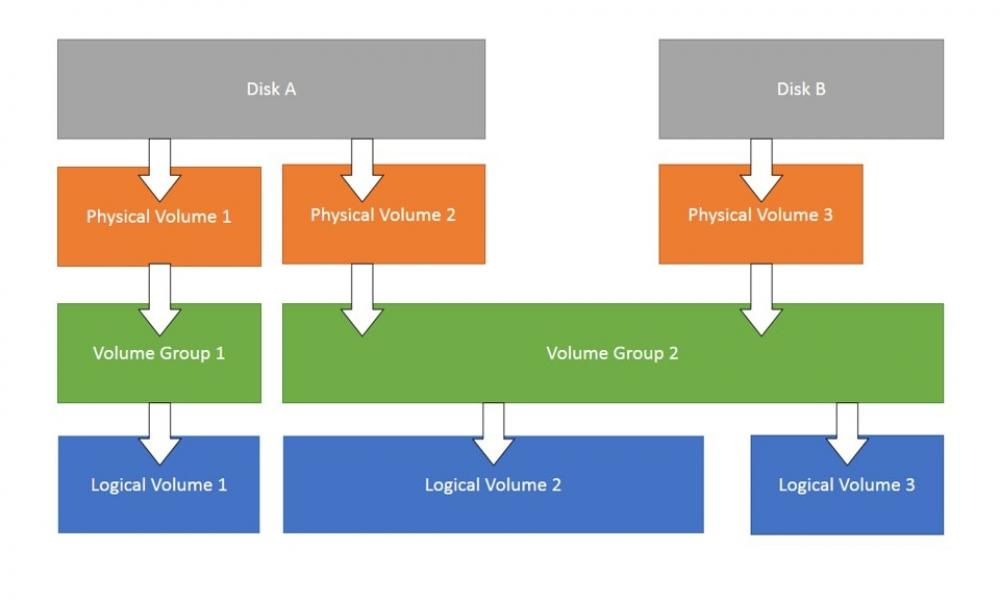

Jika kita lihat dari gambar diatas, kita sudah dapat tahu struktur dari LVM. Dimana Dia akan menggabungkan Physical volume kedalam sebuah Volume group besar. Lalu kita nantinya dapat memecah-mecahnya menjadi logical volume sesuai kebutuhan kita.

Untuk membuat sebuah LVM baru, terlebih dahulu kita tambahkan satu buah disk dengan ukuran 10 GB. Ketikkan perintah `lsblk` untuk menampilkan disk dan partisi. Disk yang baru saja kita tambahkan adalah sdb.

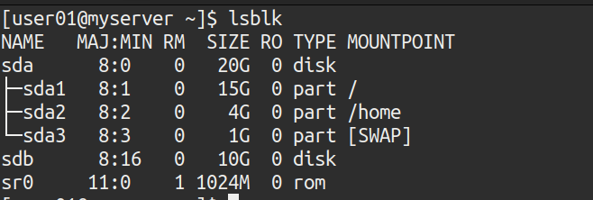

Buat sebuah partisi dengan perintah fdisk.

`fdisk /dev/sdb`

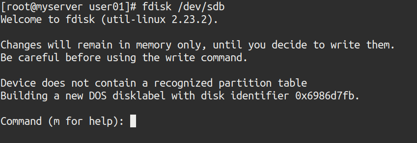

Lalu tekan n untuk membuat partisi baru.

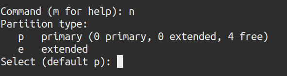

Lalu tekan p untuk memilih tipe partisi primary

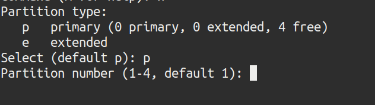

Pilih 1 karena kita hanya akan membuat satu partisi, kemudian tekan enter 2 kali.

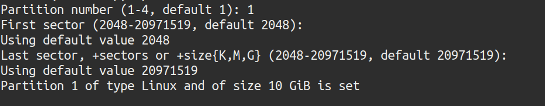

Lalu tekan t, dan kemudian tekan l untuk menampilkan tipe-tipe partisinya.

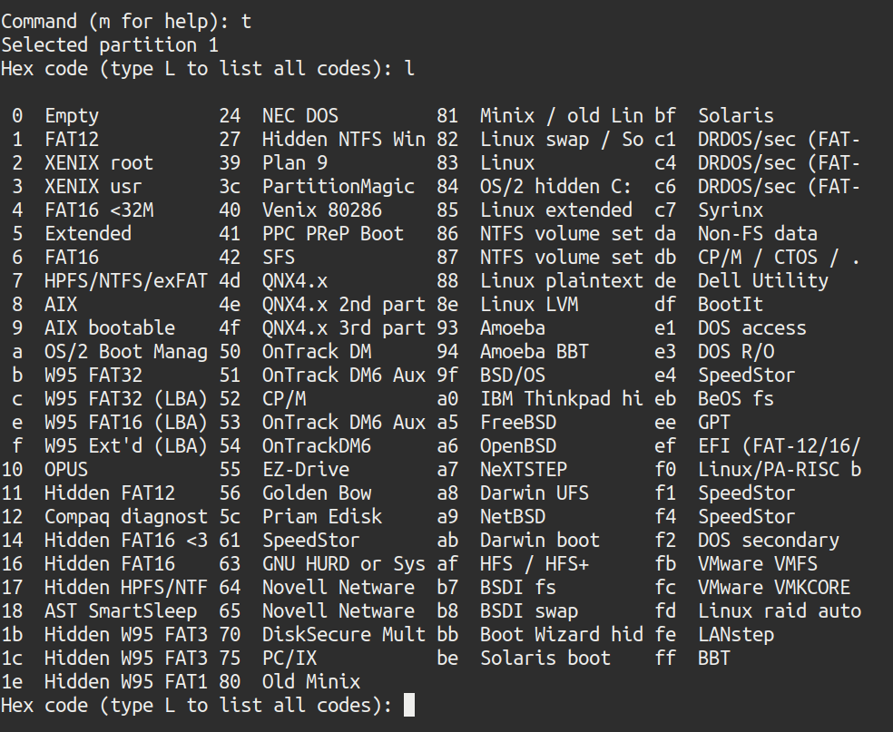

Kita pilih opsi **8e** yaitu **Linux LVM**. Dan terakhir tekan w untuk menyimpan konfigurasi tadi.

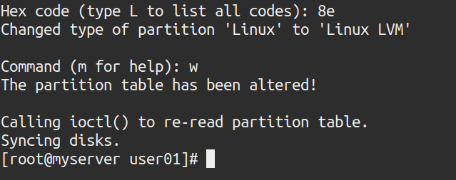

Jika kita cek kembali menggunakan perintah `lsblk` maka kita mendapati sebuah partisi baru dengan nama `sdb1`

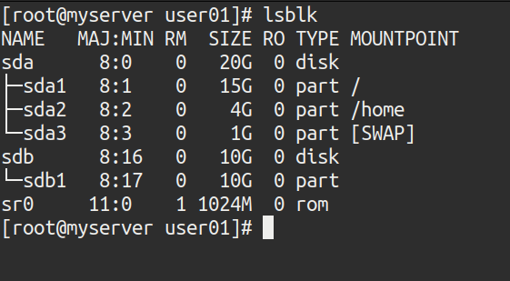

Kemudian kita akan menambahkan disk /dev/sdb1 ke LVM sebagai physical volume.

`pv create /dev/sdb1`

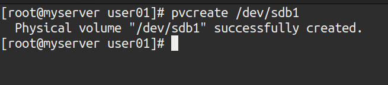

Untuk melihat list physical volume dapat kita ketikkan perintah

`pvscan`

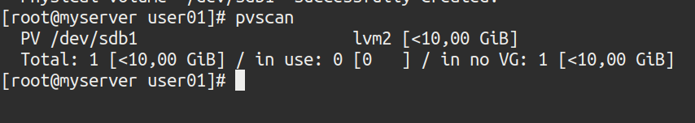

Dan untuk menampilakan informasi spesifik dari physical volume dapat ketikkan perintah

`pvdisplay /dev/sdb1`

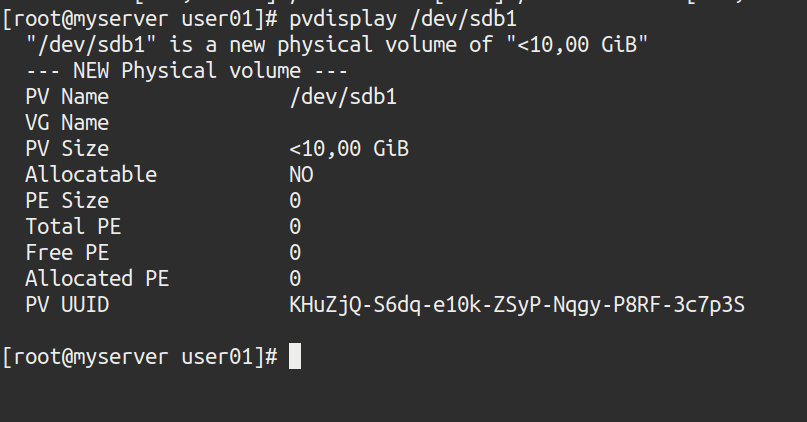

Tahap berikutnya adalah membuat sebuah volume group. Kita bisa membuat sebuah volume group dari beberapa physical volume. Tapi disini kita disini hanya membuatnya dengan satu physical volume karena kita hanya punya satu physical volume. Caranya ketikkan vgcreate nama-group disk 

`vgcreate del /dev/sdb1`

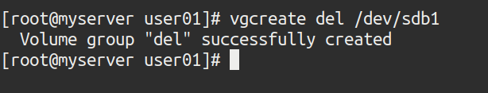

Untuk melist daftar virtual group dapat ketikkan perintah 

`vgscan`

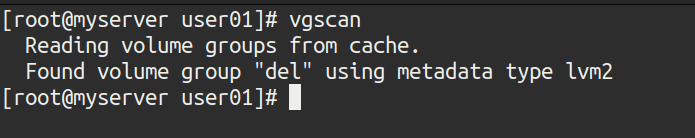

Dan untuk melihat setail spesifik virtual group dapat ketikkan

`vgdisplay del`

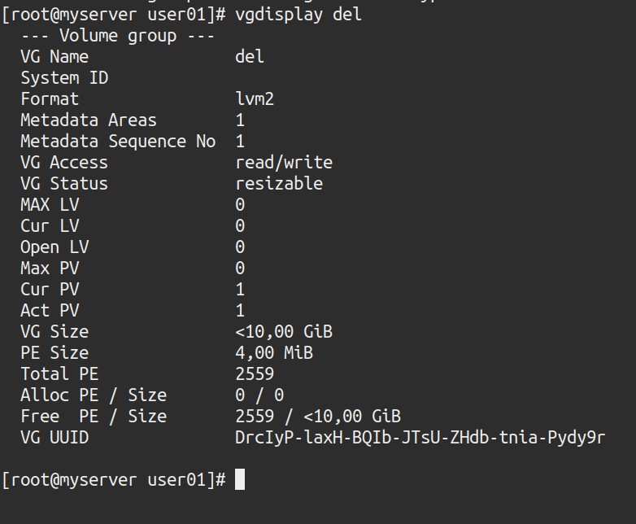

Jika ingin menambahkan lagi physical volume dapat menggunakan perintah

`vgextend nama-vgruop disk`

Sekarang kita sudah bisa membuat sebuah logical volume 

`lvcreate -n ibt -l 100%FREE del`

argumen -n berfungsi untuk mengatur nama, -l merupakan argumen untuk mengatur size dari logical volume dengan sistem berapa persen disk yang akan digunakan, sedangkan untuk menetapkan ukuran logical volume dengan ukuran angka tetap atau pasti bisa menggunakan argumen -L(penjelasan yg membingungkan). Disini kita akan menggunakan seluruh disk, oleh karena itu kita tetapkan sizenya 100%.

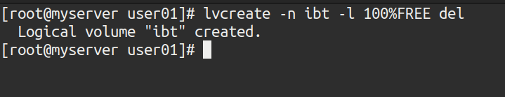

Untuk menampilkan list dari logical volume dapat menggunakan perintah `lvscan` atau `lvs`.

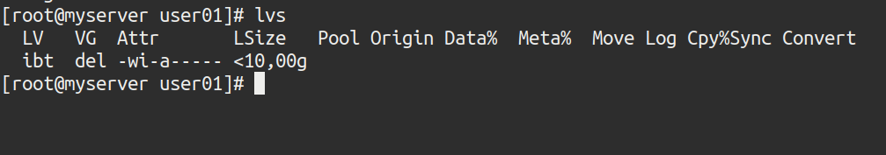

Dan untuk menampilkan detail dari logical volume dapat ketikkan perintah

`lvdisplay`

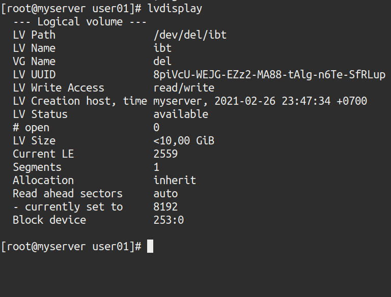

Setelah itu mari kita format logical volume kita menggunakan sistem file ext4. Ketikkan perintah berikut

`mkfs.ext4 /dev/del/ibt`

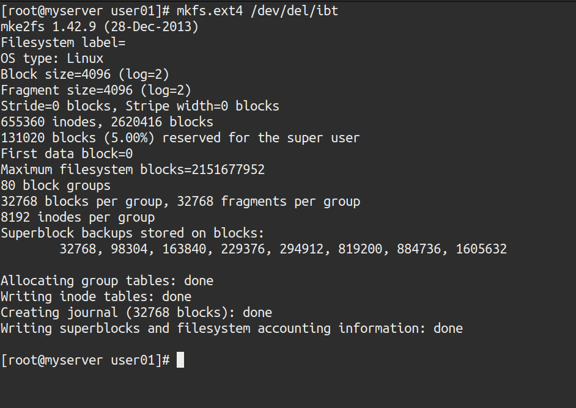

Dalam sistem file di linux ada beberapa jenis diantaranya ext, xfs, btrfs. 
- ext(Extended file system), terdapat 3 jenis yaitu ext2, ext3, dan ext4. Ext merupakan jenis sistem file pada linux yang paling sering digunakan.
	- ext2, merupakan sistem file pertama namun kini hanya sering digunakan memori flash seperti  drive USB. ext2 dapat diupgrade langsung ke ext3 tanpa harus menformat data.
	- ext3,  terdapat beberapa fitur baru dari ext2 yaitu efektif menyimpan data dua kali. Dimana data dapat dipulihkan kembalijika terjadi crash.
	- ext4, terdapat fitur-fitur baru yang mengurangi fragmentasi file, memungkinkan untuk volume dan file yang lebih besar, dan menggunakan alokasi tertunda untuk meningkatkan masa pakai memori flash. Ini adalah versi paling modern dari sistem file Ext dan merupakan default pada sebagian besar distribusi Linux.

- xfs, XFS adalah sistem file journal 64-bit yang awalnya dikembangkan oleh Silicon Graphics. Sistem file ini merupakan sistem file yang tidak rentan dengan kesalahan dan juga berjalan lebih cepat dan lebih efisien terhadap file yang besar.

- btrfs(B-Tree File System), merupakan sistem file yang dirancang oleh Oracle. Btrfs bisa dibilang merupakan sistem file paling canggih. BTRFS juga merupakan sistem penyimpanan berbasis jangkauan seperti XFS. Ini menghemat ruang untuk file kecil dan direktori yang diindeks, dan mendukung alokasi inode dinamis. Ini menangani beberapa perangkat penyimpanan dan memberikan dukungan untuk RAID striping, mirroring dan striping + mirroring. BTRFS juga sadar flash drive dengan dukungan langsung untuk operasi TRIM / buang.

Nah sekarang kita tinggal me-mount logical volume tadi. Kita bisa saja hanya menggunakan perintah mount. Namun logical volume kita tidak akan ter-mount secara otomatis ketika kita reboot server. Maka agar logical volume kita dapat termounting otomatis saat kita reboot servernya dapat kita lakukan dengan tahap berikut ini. 
Pertama-tama kita buat dulu mount poinnya. Disini kita akan buat mount poinnya di /mnt/new-disk 

`mkdir -p /mnt/new-disk `

Setelah itu kita cek UUID dari logical volume kita, lalu copy.

`blkid /dev/del/ibt`

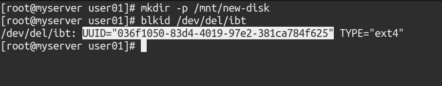

Lalu tambahkan script seperti pada gambah dibawah ini di /etc/fstab

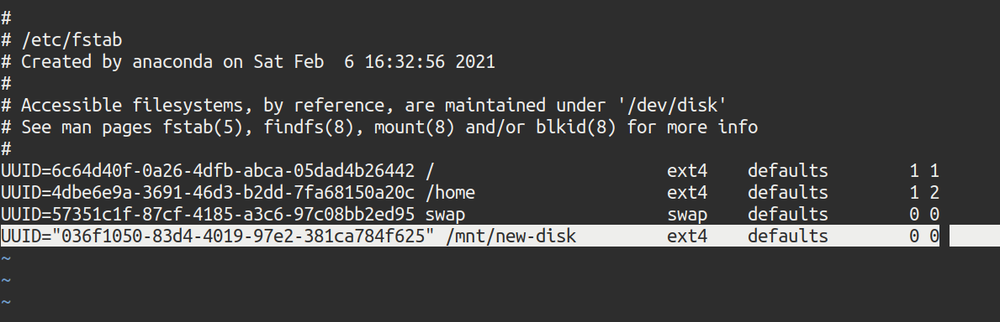

Simpan konfigurasi tersebut, lalu ketikkan perintah `mount -a` .

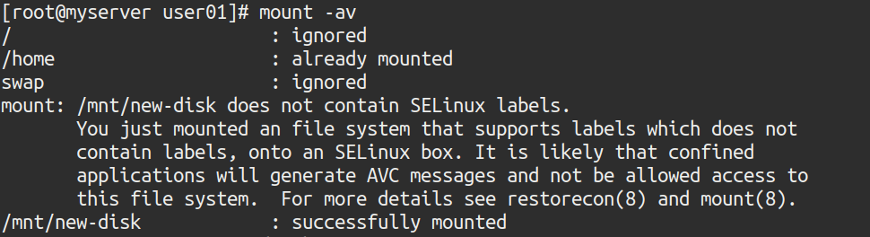

jika kita cek menggunakan perintah `df –h` maka sudah termount.

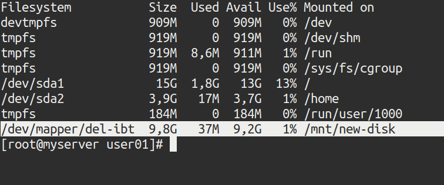

## Create New Username
Untuk menambahkan sebuah user baru kita dapat menggunakan perintah useradd. Dengan menggunakan perintah ini, kita juga bisa mengkonfigurasikan user baru saat menambahkannya, seperti letak homedir dan shell yang digunakan. 

Ketikkan perintah berikut

`useradd -m -d /mnt/new-disk/user02 -G wheel -s /bin/bash user02`

fungsi fungsi dari parameter diatas adalah:

`-m` untuk membuat homedir dari user

`-d` untuk menspesifikan lokasi dari homedir

`-G` untuk memasukkan user ke group, disini kita masukkan ke grup wheel unuk membuat user menjadi sudoer

`-s` untuk menspesifikan jenis shell yang digunakan user

setelah itu jangan lupa untuk menset password dari user dengan perintah

`passwd user02`

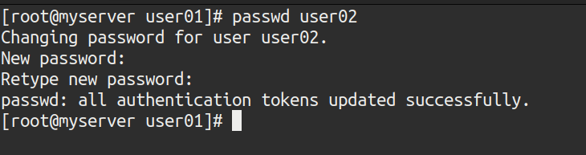

Agar kita dapat menjalankan perintah sudo privilege tanpa password dapat kita tambahkan scrpit berikut ini pada file /etc/sudoers

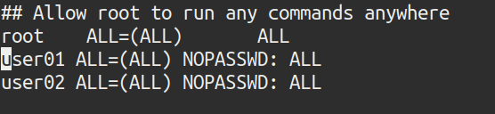

Mari kita coba login ke user02 dan mencek homedirnya

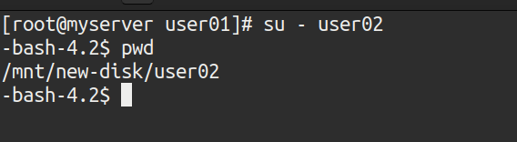

Kemudian jenis bash yang digunakan

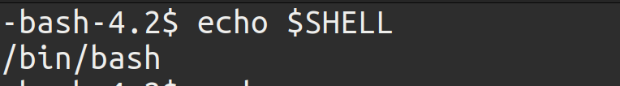

Dan user baru kita buat tadi juga sudah sudoer

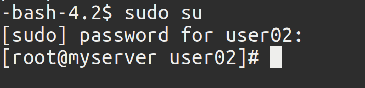

Kita coba jalankan perintah menggunakan perintah sudo. Berhasil dimana kita tidak diminta password saat menjalankan perintah sudo privilege.

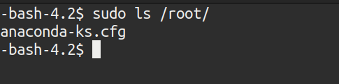

## Linux Permission

**chmod**- Perintah ini digunakan untuk mengganti permission dari sebuah file/folder. Pada dasarnya, setiap file dapat diakses oleh 3 jenis pengguna yaitu:
|pengguna   |                                                      |
|-----  | ----------------------------------------------------|
|**owner**  | Pengguna yang membuat dan memiliki file / direktori.|
|**group**  | Semua pengguna yang merupakan anggota dalam grup yang sama.|
|**others**| Semua pengguna lainnya dalam sistem yang bukan owner atau member dari sebuah grup.|

Setiap tipe permission memiliki nomornya masing-masing:
- r (read) – 4
- w (write) – 2
- x (execute) – 1

 Coba kita ketikkan perintah sudo ls -l

 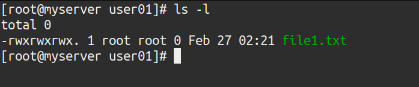

Jadi, contohnya, jika Anda ingin mengatur permission file1.txt menjadi:

-rwxr–rw-

 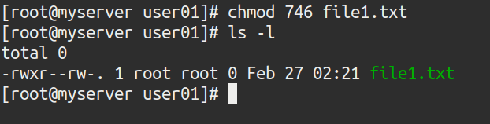

**chown**- perintah ini digunakan untuk mengganti owners dari file/folder.

Tadinya file1.txt merupkan file yang ownernya root. Kita akan ubah owner file1.txt menjadi user02
perintahnya adalah

`chown user02:user02 file1.txt`

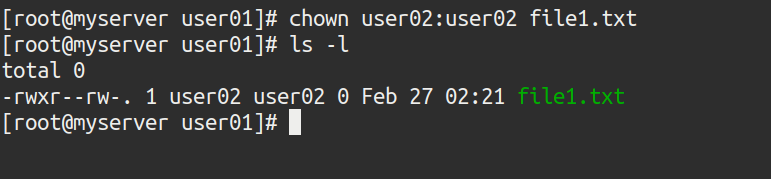

## Referensi
- https://webhostinggeeks.com/howto/create-lvm-in-linux-centos/
- https://linuxhint.com/install_lvm_centos7/
- https://www.tecmint.com/manage-and-create-lvm-parition-using-vgcreate-lvcreate-and-lvextend/
- https://www.electronicdesign.com/industrial-automation/article/21804944/whats-the-difference-between-linux-ext-xfs-and-btrfs-filesystems
- https://id.if-koubou.com/articles/how-to/which-linux-file-system-should-you-use.html
- https://linuxize.com/post/how-to-create-users-in-linux-using-the-useradd-command/
