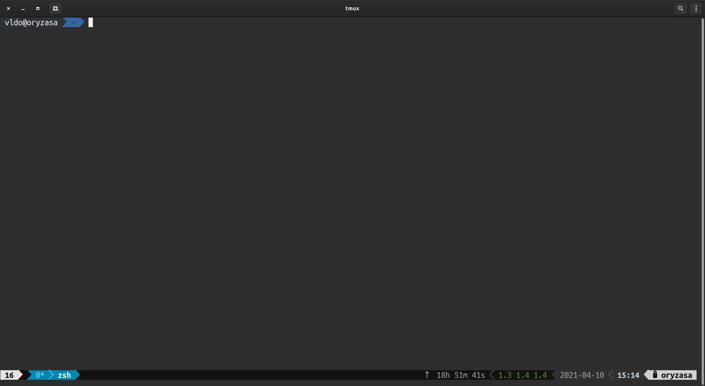
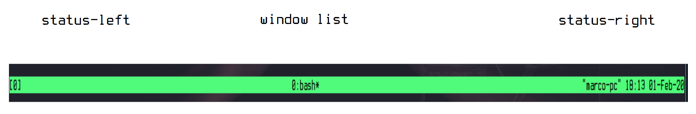
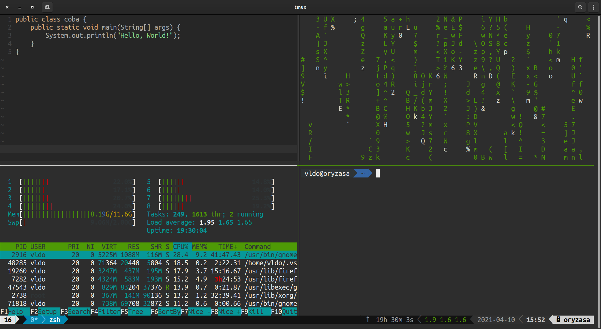

# TMUX

Hi... Kali ini kita akan bahas dikit soal tmux. Aku juga baru tahu sih soal Tmux dan belum biasa makenya. Tapi mari membiasakan menggunakan Tmux ini karena ini sangat membantu dan memudahkan kita loh(kalo udah terbiasa hehe). 


Tapi btw apaan sih Tmux itu? Tmux adalah terminal multiplexer, jadi dengan Tmux kita dapat membagi banyak jendela terminal dalam satu sesi sekaligus. Dan setiap jendela bisa dibagi menjadi beberapa panel(split). keren kan...

## Set-up Tmux
Sangat mudah untuk menginstall Tmux ini. Disini saya menggunakan sistem operasi Linux distro Ubuntu, kalian bisa sesuaikan dengan sistem operasi dan distro kalian masing-masing.

`sudo apt-get install tmux`

udah siap hahha. Dan menjalankan Tmux kita tinggal ketikkan saja `tmux` di terminal untuk memulai sesi baru. Maka tampilannya akan seperti dibawah ini.



Namun supaya mendapatkan tmux status line(status line yang ada dibawah) seperti saya ada step tambahan yang perlu dilakukan. Kalo tidak tmux status line haanya akan berwarna hijau polos seperti gambar ini.



Mari kita install dulu font powerline. 

`sudo apt-get install powerline`

Setelah itu buat file config untuk tmux.

`vim ~/.tmux.conf`

Terus tambahkan script ini kedalam.
```
source /usr/share/powerline/bindings/tmux/powerline.conf
```

Lalu jalankan perintah ini untuk source file confg tadi. 

`tmux source ~/.tmux.conf`

Dan sekarang kamu udah punya tmux status line yang nampak lebih menarik.

Sesi Tmux diberi nama numerik (0/1/2/dst) secara default. Memberi nama sesi tentunya akan sangat membantu ketika kamu menjalankan banyak sesi Tmux.

Untuk membuat sesi Tmux baru dan memberinya nama sekaligus kamu bisa menjalankan perintah tmux dengan argumen tambahan:

`tmux new -s nama_sesi`

## Tmux Window dan Panel

Saat kita membuat Tmux sesi baru, secara default akan dibuatkan satu window terminal Tmux. Dan untuk menggunakan Tmux berikut perintah-perintah yang bisa kita gunakan untuk mempermudah kita dalam memanajemen window terminal kita.

| Command | Fungsi |
|---------|--------|
| `Ctrl+b c` | Membuat window baru|
| `Ctrl+b w` | Memilih window dari list yang ada|
| `Ctrl+b 0` | Mengganti window ke 0|
| `Ctrl+b ,` | Mengganti nama window yang sedang berjalan|
| `Ctrl+b %` | Membagi panel menjadi dua secara horizontal|
| `Ctrl+b "` | Membagi panel menjadi dua secara vertikal|
| `Ctrl+b o` | Berpindah ke panel berikutnya|
| `Ctrl+b ;` | Berpindah antara panel yang sedang berjalan dan ke panel berikutnya|
| `Ctrl+b x` | Menutup panel yang sedang berjalan|

