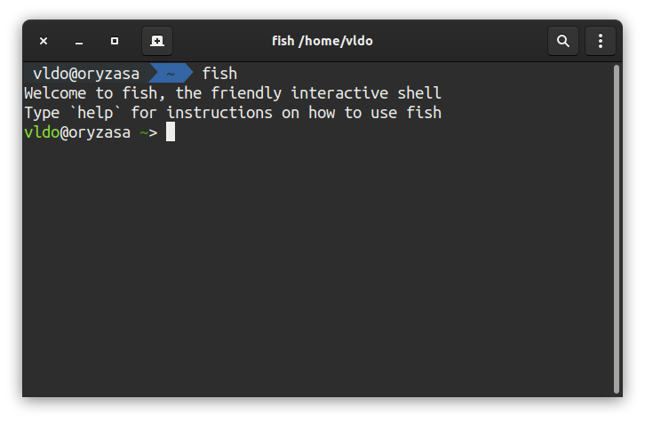
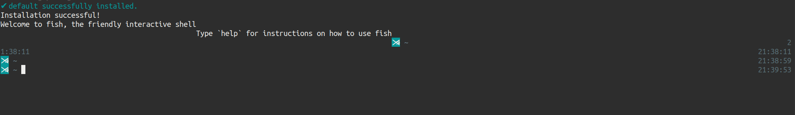
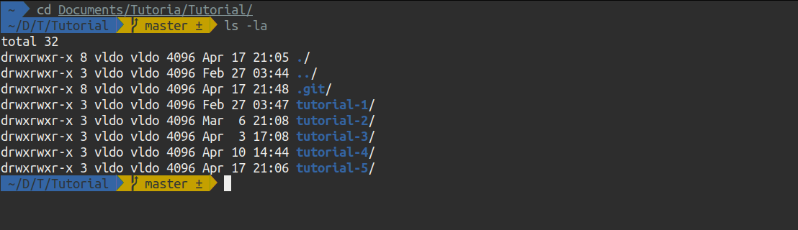
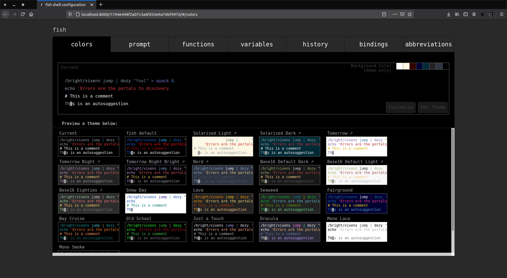

# Fish Shell

Halo semua. Kali ini kita bakal bahas yang ringan-ringan lagi nih, tapi sangat berguna untuk memudakan kita dalam bekerja dan meningkatkan produktivitas. Apa yang bakal kita bahas itu? Yup betul sekali(kan kalian udah baca judulnya :v) Fish Shell. Fish yang memiliki kepanjangan **Friendly Interactive Shell** merupakan salah satu shell open source yang populer dan cukup banyak digunakan. Ada fitur-fitur canggih dari Fish yang bikin kamu nyaman makenya. Seperti auto-suggestion yang berbasis dari history, tab completion, ada juga syntax highlighting loh. Sangat mudah juga untuk mengkonfigurasikannya, sampe dibikinin web based configuration.

## Instalasi
Tanpa basa-basi mari kita langsung install fishnya. Mancing mania? Mantap!(ehh salah :v). Disini saya menggunakan distro Ubuntu. Bisa disesuaikan dengan sistem operasi dan distro kalian masing-masing.

`sudo apt-get update`

`sudo apt-get install fish`

Lalu instal font powerline

`sudo apt-get install fonts-powerline`

Lalu ketikkan `fish` untuk membuka shell fish. Dan kita bakal disambut oleh fish

Untuk membuat fish menjadi default shell bisa ketikkan perintah 

`chsh -s /usr/bin/fish`

Lalu restart 

Nah sama seperti zsh yang punya oh-my-zsh, fish juga punya oh-my-fish untuk kita bisa mendandani shell fish kita. jalankan perintah ini untuk menginstall

curl -L https://get.oh-my.fish | fish

Maka tampilan shell kita bakal jadi begini(sorry gambarnya kecil)

Setelah itu mari kita install theme baru. Disini aku bakal pake theme agnoster kesukaanku. Untuk pilihan themenya bisa dilihat aja di githubnya oh-my-fish. https://github.com/oh-my-fish/oh-my-fish/blob/master/docs/Themes.md .

`omf install agnoster`

Dan boom lihat betapa cantiknya terminal kita sekarang. 

Fish juga berbeda untuk masalah file konfigurasinya. Tidak seperti bash dan zsh yang menggunakan `.bashrc` dan `.zshrc` fish menyimpan file konfigurasinya di `~/.config/fish/config.fish` .

Dan seperti kubilang di awal. Kita bisa mengkonfigurasinya menggunakan basis web. Tinggal ketikkak perintah `fish_config` maka akan terbuka web untuk konfigurasi fish kamu di browser. 

Untuk lebih lanjut kamu bisa oprek-oprek di dokumentasi resmi fish. linknya dibawah ini

https://fishshell.com/docs/current/index.html