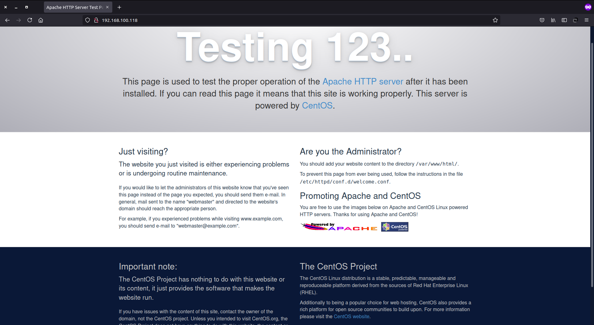
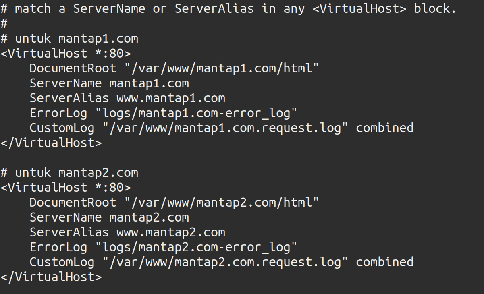

# Setup l[a,e]mp stack

## Setup Web Server

### NGINX
Untuk menginstall web server nginx kita dapat menginstallnya dengan dua cara yaitu:
- menggunakan repo
- install dari source code

**- Menggunakan Repo**

nginx tidak ada pada repo default centos 7, oleh karena itu kita tambahkan dulu repo epel-repository

`yum install https://dl.fedoraproject.org/pub/epel/epel-release-latest-7.noarch.rpm`

setelah itu kita bisa langsung menginstall nginx dengan perintah yum 

`yum install nginx`

coba kita cek versi nginx nya


**- Build dari source code**
jika kita perhatikan versi nginx yang baru saja kita install dengan cara install dari repo, versi nginx tersebut adalah versi yang lama. Jika kita ingin menginstall nginx dengan versi tertentu atau bahkan versi latest, kita bisa menginstallnya dengan cara membuild atau mengcompile source code dari nginx.

pertama-tama kita install dahulu dependensi yang dibutuhkan

`yum install zlib-devel openssl-devel pcre-devel `

setelah itu mari kita download dan ekstrak file installer nginx, disini kita menggunakan versi stable yaitu 1.18.0 . Lalu masuk ke folder hasil ektrak.

```
wget https://nginx.org/download/nginx-1.18.0.tar.gz
tar zxf nginx-1.18.0.tar.gz
cd nginx-1.18.0
```

Setelah masuk ke direktori installer nginx kita jalankan perintah untuk mengkonfigurasi letak folder-folder terkait nginx dan modules yang kita gunakan. 

```
./configure --sbin-path=/usr/sbin/nginx \ 
--conf-path=/etc/nginx/nginx.conf \
--error-log-path=/var/log/nginx/error.log \
--http-log-path=/var/log/nginx/access.log \
--with-pcre \
--with-http_ssl_module
```

konfigurasi yang kita lakukan diatas adalah: 

- _--sbin-path_: adalah lokasi binari atau file executable dari nginx
- _--conf-path_: adalah lokasi file konfigurasi
- _--error-path_: adalah lokasi file log error
- _--http-log-path_: adalah lokasi file log http
- _--with-pcre_: menambahkan modul pcre
- _--with-http\_ssl\_module_: menambahkan modul ssl http

jika berhasil maka akan tampil output seperti dibawah ini yang menunjukkan hasil configurasi


lalu conpile dan install
```
make 
make install
```

mari kita coba cek


untuk menjalankan servis bisa kita ketikkan perintah

`nginx`

Lalu kita coba akses melalui browser


untuk memudahkan kita dalam bekerja dan kita bisa menjalankan servis nginx secara on boot kita buatkan unit file untuk nginx di _/etc/systemd/system/nginx.service_ . tambahkan script seperti berikut

```
# vi /etc/systemd/system/nginx.service

[Unit]
Description=NGINX
After=syslog.target network.target remote-fs.target nss-lookup.target

[Service]
Type=forking
PIDFile=/usr/local/nginx/logs/nginx.pid
ExecStart=/usr/sbin/nginx
ExecReload=/usr/sbin/nginx -s reload
ExecStop=/usr/sbin/nginx -s quit

[Install]
WantedBy=multi-user.target
```

lalu load file tadi ke systemd

`systemctl daemon-reload`

sekarang kita bisa menjalankan servis nginx dengan perintah `systemctl`


Mari kita coba membuat virtual host menggunakan nginx. Sebelum itu apa itu dan fungsi dari virtual host? dengan virtual host kita dapat menjalankan beberapa website secara bersamaan di satu server. Dimana setiap website akan berada di folder masing-masing. Oleh sebab itu virtual host disebut juga server block.

pertama kita buat 2 folder baru 
mkdir -p /var/www/mantap1.com/html
mkdir -p /var/www/mantap2.com/html

untuk domain pertama

```
# vi /var/www/mantap1.com/html/index.html

<!DOCTYPE html>
<html>
  <body>
        <h1>Mantap 1</h1>
        <p>Berjalan dengan baik</p>
  </body>
</html>

```

untuk domain kedua
```
#vi /var/www/mantap2.com/html/index.html
<!DOCTYPE html>
<html>
  <body>
        <h1>Mantap 2</h1>
        <p>Berjalan dengan baik</p>
  </body>
</html>

```

setelah itu kita membuat dua direktori yaitu:
- _sites-available_: folder untuk menyimpan file konfigurasi server block
- _sites-enabled_: folder yang akan memberitahu tautan mana yang akan ditampilkan dan mana yang diblok
  
`mkdir /etc/nginx/sites-available /etc/nginx/sites-enabled`

lalu edit file konfigurasi nginx

`vi /etc/nginx/nginx.conf`

tambahkan dua baris script berikut ini

```
include /etc/nginx/sites-enabled/*.conf;
server_names_hash_bucket_size 64;
```


lalu kita buat file server blok pada setiap domain kita:

- untuk mantap1.com

```
# vi /etc/nginx/sites-availabe/mantap1.com

server {
        listen 80;
        listen [::]:80;

        root /var/www/mantap1.com/html;
        index index.html index.htm;

        server_name mantap1.com www.mantap1.com;

        location / {
                try_files $uri $uri/ =404;
        }
}

```

- untuk mantap2.com

```
# vi /etc/nginx/sites-availabe/mantap2.com

server {
        listen 80;
        listen [::]:80;

        root /var/www/mantap2.com/html;
        index index.html index.htm;

        server_name mantap2.com www.mantap2.com;

        location / {
                try_files $uri $uri/ =404;
        }
}
```

lalu kita aktifkan block server kita 

```
ln -s /etc/nginx/sites-available/mantap1.com /etc/nginx/sites-enabled/mantap1.com.conf
ln -s /etc/nginx/sites-available/mantap2.com /etc/nginx/sites-enabled/mantap2.com.conf
```

lalu restart servis nginx

`systemctl restart nginx`

agar kita bisa mengakses domain yang kita buat tadi, kita dapat menambahkan script berikut di komputer lokal kita

```
# /etc/hosts

127.0.0.1 localhost
192.168.100.118 mantap1.com www.mantap1.com
192.168.100.118 mantap2.com www.mantap2.com
```

Lalu akses dengan browser


### Apache

Sama seperti nginx disini kita akan mencoba menginstall apache dengan dua cara yaitu melalui repo dan build dari source code.

**- Melalui repo**

Apache sudah tersedia pada repo default centos 7. jadi kita hanya perlu menjalankan perintah dibawah ini.

`yum install httpd`

Lalu kita coba jalankan servis apache

`systemctl start httpd`

kemudian akses melalui browser.



**- Build from source code**

Pertama install dependensi yang dibutuhkan

`yum install autoconf expat-devel libtool libnghttp2-devel pcre-devel`

lalu download source code apache serta source code apr(apache portable runtime) dengan apr-util untuk melakukan mengcompile.

```
wget https://httpd.apache.org/httpd/httpd-2.4.48.tar.gz # apache http

wget https://downloads.apache.org//apr/apr-1.7.0.tar.gz # apr

wget https://downloads.apache.org//apr/apr-util-1.6.1.tar.gz # apr-util
```


lalu esktrak ketiga file tersebut

```
tar -xzf httpd-2.4.46.tar.gz
tar -xzf apr-1.7.0.tar.gz
tar -xzf apr-util-1.6.1.tar.gz
```

copy APR library pada folder seperti pada perintah dibawah
```
cp -r apr-1.7.0 httpd-2.4.46/srclib/apr
cp -r apr-util-1.6.1 httpd-2.4.46/srclib/apr-util
```

lalu kita compile source code dan install

```
./buildconf
./configure --enable-so
make 
make install
```

Mari kita coba menjalankan servis apache tersebut

`/usr/local/apache2/bin/./apachectl start`

dan kita akses browser


Lalu kita buatkan unit file untuk servis apache

```
# vi /etc/systemd/system/httpd.service

[Unit]
Description=Apache HTTP Server
After=network.target

[Service]
Type=forking
ExecStart=/usr/local/apache2/bin/apachectl -k start
ExecReload=/usr/local/apache2/bin/apachectl -k graceful
ExecStop=/usr/local/apache2/bin/apachectl -k graceful-stop
PIDFile=/usr/local/apache2/logs/httpd.pid
PrivateTmp=true

[Install]
WantedBy=multi-user.target
```

lalu load ke systemD

`systemctl daemon-reload`

lalu kita coba jalankan 


Kita akan membuat virtual host menggunakan apache. Untuk file html-nya kita akan menggunakan file yang sama pada nginx yang tadi kita kerjakan(mantap1.com & mantap2.com). 

Lalu pada file konfigurasi http(/usr/local/apache2/conf/httpd.conf) tambahkan script ini 

```
<Directory /var/www>
    Options Indexes MultiViews
    AllowOverride all
    Require all granted
</Directory>
```


dan uncomment pada baris ini untuk mengaktifkan virtual hosts


lalu kita ubah file virtual host bawaan apache dengan script berikut

```
# vi /usr/local/apache2/conf/extra/httpd-vhost.conf

<VirtualHost *:80>
    DocumentRoot "/var/www/mantap1.com/html"
    ServerName mantap1.com
    ServerAlias www.mantap1.com
    ErrorLog "logs/mantap1.com-error_log"
    CustomLog "/var/www/mantap1.com.request.log" combined
</VirtualHost>

# untuk mantap2.com
<VirtualHost *:80>
    DocumentRoot "/var/www/mantap2.com/html"
    ServerName mantap2.com
    ServerAlias www.mantap2.com
    ErrorLog "logs/mantap2.com-error_log"
    CustomLog "/var/www/mantap2.com.request.log" combined
</VirtualHost>
```



lalu restart servis apache

`systemctl restart httpd`

sekarang kita bisa akses melalui browser 


### Perbedaan Apache dan NGINX 

| Apache        | NGINX         |
|---------------|---------------| 
| Dapat dijalankan di sistem Unix like seperti Linux, BSD, Mac, dll. dan juga dapat dijalankan di windows | Dapan dijalankan di system Unix like yang modern dan support pada windows namun terbatas |
| Menggunakan multi-thread untuk memproses request client | Menggunakan event-driven untuk request client | 
| Apache tidak dapat menangani banyak permintaan secara bersamaan dengan lalu lintas web yang padat | Nginx dapat menangani beberapa permintaan klien secara bersamaan dan efisien dengan resources hardware yang terbatas | 
| Apache hanya didesain sebagai web server | NGINX dapat menjadi web server dan proxy server | 
| Modul dapat dikonfigurasi secara dinamis dan fleksibel | Konfigurasi modul hanya bisa dilakukan saat melakukan compile NGINX di awal |
| Single thread hanya dapat memproses satu connection | Singgle thread dapat meng-handle beberapa connection |
| Penulisan konfigurasi virtual host ditulis dengan format XML | Penulisan konfigurasi virtual host seperti bahasa C |


## Setup Application

Disini kita akan menggunakan bahasa pemrograman php untuk bagian aplikasi. Telebih dahulu kita tambahkan repo IUS dengan menjalankan perintah 

```
yum install \
https://repo.ius.io/ius-release-el7.rpm \
https://dl.fedoraproject.org/pub/epel/epel-release-latest-7.noarch.rpm
```

Lalu install php 

`yum install php73-common php73-fpm php73-mysqlnd`

lalu jalankan servis php 

```
systemctl start php-fpm
systemctl enable php-fpm
```


Mari kita coba tes membuat aplikasi php. disini kita akan tambahkan file php pada mantap1.com

```
# vi /var/www/mantap1.com/html/index.php

<?php 
  phpinfo();
?>
```

lalu edit file konfigurasi Nginx pada mantap1.com

```
# vi /etc/nginx/sites-available/mantap1.com

server {
        listen 80;
        listen [::]:80;

        root /var/www/mantap1.com/html;
        index index.php index.html index.htm index.nginx-debian.html;

        server_name mantap1.com www.mantap1.com;

        location ~ \.php$ {
                fastcgi_pass   127.0.0.1:9000;
                fastcgi_param  SCRIPT_FILENAME  $document_root$fastcgi_script_name;
                include fastcgi_params;
        }
}

```     

lalu restart servis nginx

`systemctl restart nginx`

lalu akses mantap1.com di browser


### Setup Database

Kita akan menggunakan mariadb untuk database kita. Untuk menginstall mariadb kita membutuhkan repo tambahan. Tadi kita sudah menginstall repo IUS, sekarang kita bia langsung install mariadb.

`yum install mariadb103-server`

lalu aktifkan servis mariadb

```
systemctl start mariadb
systemctl enable mariadb
```


lalu kita konfigurasi mysql-nya. pertama jalankan perintah ini

`mysql_secure_installation`

Lalu kita akan disuruh menginput password untuk root user. Karena kita belum mengkonfigurasinya, tekan saja enter.


setelah itu kita akan ditanyakan untuk set password root. maka ketikkan y lalu enter, lalu ketikkan password root. 


Lalu ketikkan y lagi untuk menghapus anonymous user


agar saat kita login sebagai root hanya bisa diakses melalu localhost ketikkan y .


Lalu ketikkan lagi y untuk menghapus test database


Terakhi ketikkan y untuk mereload privileges dan menjalankan konfigurasi tadi


Konfigurasi yang tadi kita lakukan berjalan dengan baik


Untuk login ke mysql bisa gunakan perintah berikut 

`mysql -u root -p`


kita juga bisa menambahkan user baru. jalankan script 

`CREATE USER 'user'@'host' IDENTIFIED BY 'password';`


Dari statement dia atas kita akan membuat sebuah user baru dengan nama user01 di localhost, dengan password yang tertera pada gambar. 

Lalu kita akan memberikan privileges untuk user yang baru saja kita buat

`GRANT ALL PRIVILEGES ON database_name TO 'user'@'host';`


**- GRANT ALL PRIVILEGES** untuk membuat user dapat menjalankan semua priviliges.

**- ON \*.\*** Untuk menset database yang dapat dijamah atau diset oleh user. tanda \*.* untuk menyatakan semua tabel. 

**- TO** Untuk menspesifikkan user.

untuk menyinpan konfigurasi dan membersihkan memori dari cache ketikkan

`FLUSH PRIVILEGES;`

Untuk keluar ketikkan 

`exit;`

Mari kita test login ke user yang barusan kita buat.


