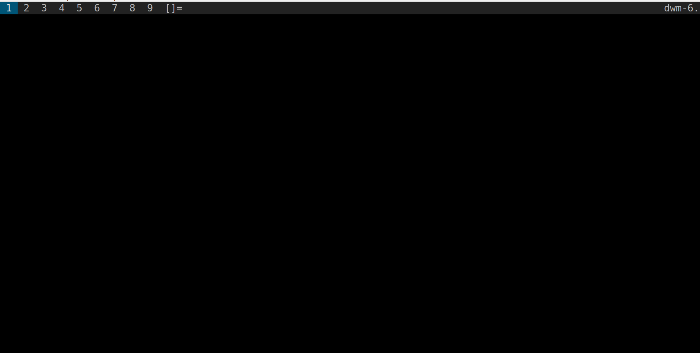
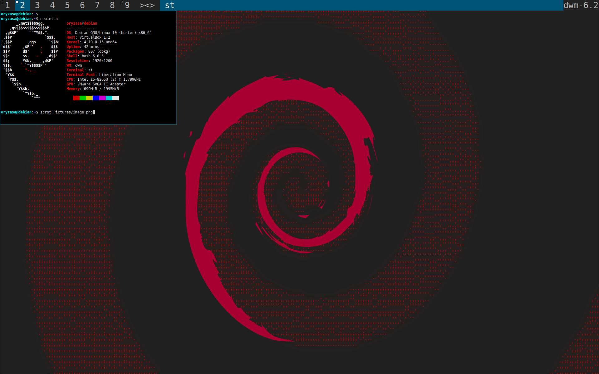

# Install dwm

Kali ini kita akan mencoba menggunakan dwm. Merasa berat menggunakan DE(Desktop Environment? Window manager bisa menjadi solusinya. Dan disini window manager yang kita gunakan adalah dwm. Untuk distro yang dipakai adalah Debian 10(tanpa GUI), jadi kalian bisa sesuaikan caranya(palingan bedanya di instalasi package doang). 

Baiklah pertama-tama kita install dulu package yang diperlukan

```
sudo apt-get install xorg xserver-xorg build-essential libxft-dev libxinerema-dev libx11-dev
```

Setelah itu download dan ekstrak file installernya. Untuk link dwm bisa klik [ini](https://dwm.suckless.org/)

```
wget https://dl.suckless.org/dwm/dwm-6.2.tar.gz
tar -zxf dwm-6.2.tar.gz
cd dwm-6.2
```

Lalu tinggal kita install saja dengan perintah

```
sudo make clean install
```

Nah selain itu kita juga membutuhkan [st](https://st.suckless.org/)(simple terminal) dan [dmenu](https://tools.suckless.org/dmenu).

Install st
```
wget https://dl.suckless.org/st/st-0.8.4.tar.gz
tar -zxf st-0.8.4.tar.gz
cd st-0.8.4
sudo make clean install
```

Install dmenu:
```
wget https://dl.suckless.org/tools/dmenu-5.0.tar.gz
tar -zxf dmenu-5.0.tar.gz
cd dmenu-5
sudo make clean install
```

Nah tahap berikutnya kita buat sebuah file `.xinitrc` untuk menjalankan dwm secara otomatis, dimana berisi script berikut.

```
exec dwm
```

nahh sekarang bisa kita tinggal jalankan perintah `startx`. dan kita akan mendapatkan tampilan desktop berikut



nahh selamat kita sudah berhasil menginstall dwm. Tapi kita akan coba pasang juga background. Sebelum itu kita harus ke terminal dulu. Untuk mengakses st bisa gunakan kombinasi tombol *alt* + *shift* + *enter*. 

lalu kita bisa gunakan `feh`. Jalankan perintah berikut

```
sudo apt-get install feh
feh --bg-scale gambar.png
```

Dan selesai horee. Berikut hasilnya kalo punyaku



Sebenarnya masih banyak lagi ang bisa kita otak-atik terkait dwm dan pstinya menarik dan keren, tapi sampe sini ajalah dulu ya. Kapan-kapan kita lanjutkan hehe. Ditunggu aja yaa.