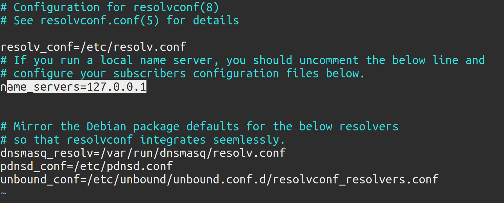

# DNSCrypt 

Halo semuanya, ada yang main reddit? Yup salah satu platform sosial ini memang keren, banyak banget diskusi-diskusi menarik didalamnya. Bahkan beberapa problem yang saya temui saat menggunakan linux, saya mendapatkan solusinya dari redit. Bermacam-macam topik dan komunitas juga banyak disana. Mau cari meme? yahh lebih bagus dai reddit daripada ig(hehe para user ig jangan tersinggung ya, kan hak saya ga suka ig :v). 

Tapi untuk mengakses reddit itu susah di Indonesia. Yup betul, akses reddit di Indonesia diblokir sama pemerintah. Mau pake ISP apapun yah nggak bisa akes reddit. Padahal seperti yang saya bilang tadi, reddit itu bagus banget. 

Sebenarnya kita bisa mengatasi masalah tersebut dengan mengotak-atik isi `etc/hosts`. Kalian bisa lihat caranya [disini](https://medium.com/jasonganub/how-to-access-reddit-in-indonesia-d185bb532380)

Nah namun disini kita akan menggunakan tool yang bernama DNSCrypt. Apa itu? Kalo kita baca dari dokumentasi yang bisa kalian cek [disini](https://dnscrypt.info/).

*DNSCrypt is a protocol that encrypts, authenticates and optionally anonymizes communications between a DNS client and a DNS resolver. It prevents DNS spoofing. It uses cryptographic signatures to verify that responses originate from the chosen DNS resolver and haven’t been tampered with.*

Jadi protokol ini akan meng-anonymizes komunikasi antara DNS client dan DNS resolver. Jadi kita bisa mengakses apapun situs yang diblokir. Bukan hanya reddit. 

Penasaran caranya? Yuk gaslah

Pertama kita perlu menginstall paket dnscrypt-proxy

```
sudo apt-get install dnscrypt-proxy
```

Kemudian kita aktifkan service agar berjalan onboot

```
sudo systemctl enable dnscrypt-proxy.socket
```

Dan jalankan juga service-nya

```
sudo systemctl start dnscrypt-proxy.socket
```

Lalu kita bisa cek status dari service

```
sudo systemctl status dnscrypt-proxy.socket
```

Lalu kita beralih ke konfigurasi `resolv.conf`.

Install terlebih dulu paket openresolv

```
sudo apt-get install openresolv
```

Lalu kita akan menginstruksikan NetworkManager agar menggunakan openresolv. caranya kita buat sebuah file konfigurasi dalam direktori NetworkManager config. Buat sebuah file `/etc/NetworkManager/conf.d/rc-manager.conf` lalu isikan dengan script dibawah

```
# sudo vim /etc/NetworkManager/conf.d/rc-manager.conf

[main]
rc-manager=resolvconf
``` 

nah lalu kita konfigurasi openresolv-nya. pada file `/etc/resolvconf.conf` kita uncomment pada baris yang ada `name_servers=` 



Simpan konfigurasi lalu kita restart service NetworkManager

```
sudo systemctl restart NetworkManager.service
```

Setelah itu mari kita cek dulu isi file `/etc/resolv.conf`

```
cat /etc/resolv.conf
```

Jika berhasil seharusnya nameserver berubah menjadi `nameserver 127.0.0.1`. tapi kita harus menunggu beberapa menit sambil melakukan restart servis Networkmanager. Tapi bisa kita gaskan langsung kok dengan menjalankan perintah ini 

```
sudo resolvconf -u
```

Nah jika sudah maka tampilan file `/etc/resolv.conf` akan seperti ini 

```
# Generated by resolvconf
nameserver 127.0.0.1
```

Nah sekarang kita sudah bisa membuka pornhub yee. ehh maksudnya reddit sorry salah bilang. Mari kita coba.


Horee berhasil, Sekarang ayo kalian coba. Jadi bisa hemat duit ga usah beli VPN kan. Selamat mencoba ya semuanya. Thank you...
